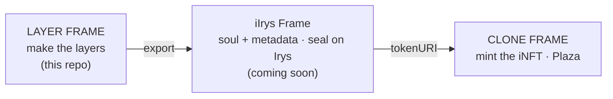

<div align="center">

# LAYER FRAME

**Decompose any artwork into clean, mint-ready layers — right in the browser.**

The image-layering studio of the **CLONE FRAME · iCLONE** toolkit. Turn one flat image into a
structured layer stack, then hand it off to **iIrys Frame** to seal on Irys and mint as an
**iNFT** in **CLONE FRAME**.

`LAYER FRAME` is the product · `ilayerframe` is this repo.

[](LICENSE)
[](CONTRIBUTING.md)
[](#-privacy--security)
[](#-contributing)

</div>

---

## What it is

LAYER FRAME is the **open, free tool** where you build the layers of your NFT art. It runs
entirely in your browser — **no server, no account, no data leaves your device** — and ships
as a single HTML file (`index.html`). Open it and it works.

It is the first step of the CLONE FRAME open-tools pipeline: here you make the layers, then
you send them to **iIrys Frame** to attach the agent soul + metadata and seal them on Irys.

## Where it fits



1. **LAYER FRAME (here)** — split an image into clean layers (background, traits, iQR,
   description), compose the final art and export the stack.
2. **iIrys Frame** — attach the agent soul (`neural_soul.md`) + metadata and seal everything
   permanently on **Irys** (produces the `tokenURI`). *(separate repo, coming soon)*
3. **CLONE FRAME** — mint the layered art as an **iNFT** (agent + NFT) on Base and list it in
   the Plaza marketplace. Repo: [devclone20/clone-frame](https://github.com/devclone20/clone-frame).

## ✦ Features

- **Split & AI Auto-Layer** — colour decomposition that *preserves the original* brightness,
  glass/transparency and anti-aliased edges. Tiny figures and glints survive (Detail mode)
  instead of being smoothed away. Split fidelity: Clean ↔ Detail.
- **✨ Glow layer** — an adaptive highlight/bloom pass extracts the light into its own soft
  layer so the glow reads on the final composite.
- **Floor / background** — auto-detects the backdrop colour and lays a full-canvas solid base,
  so the collection always has a complete, clean background.
- **Precise selection tools** — pick, paint, pen (lasso), polygon, box, points, edge select,
  magic erase, despeckle — with edge snapping and feathering.
- **iQR slot** — generate a QR linked to your site and merge it into a dedicated layer slot.
- **Description iNFT slot** — cyberpunk text templates with auto-fit (always fits its box,
  centred and faithful) and neon font styles.
- **Merge & compose** — a draggable board to arrange, merge and export the final iNFT.
- **My Layers** — a permanent local library (IndexedDB) to save, reload and export
  collections. Nothing is uploaded; it stays on your device.
- **Definições / Settings** — appearance, engine and licence & rights in one hub.
- **Apple-style UI** — dark-first, island navigation, glass-gel controls, top-bar
  notification island.

## 🚀 Quick start

No build step. No dependencies to install.

```bash
git clone https://github.com/devclone20/ilayerframe.git
cd ilayerframe
# then just open index.html in a browser:
open index.html        # macOS
# xdg-open index.html  # Linux
# start index.html     # Windows
```

Or serve it locally (recommended, so the browser allows everything):

```bash
python3 -m http.server 8123
# open http://localhost:8123/
```

> With GitHub Pages enabled, the app also runs straight from the web at
> **devclone20.github.io/ilayerframe**.

## 🗺️ Roadmap

- [x] World-class layering engine (fidelity-preserving Split / AI / Glow / Floor)
- [x] iQR + Description iNFT slots
- [x] My Layers permanent library
- [x] Definições / Settings hub (appearance, engine, licence & rights)
- [ ] **iIrys Frame handoff** — one-click export preset for sealing on Irys
- [ ] **Native desktop apps — macOS, Windows, Linux** (next focus)
- [ ] Drag-and-drop collection batching
- [ ] Pluggable export presets per marketplace

## 🤝 Contributing

**Builders are welcome — come improve and perfect this.** Whether it's the layering math,
the UI polish, performance, accessibility, new export formats, or the upcoming native apps:
your PRs are wanted.

1. Read **[CONTRIBUTING.md](CONTRIBUTING.md)**.
2. Fork the repo and create a branch: `git checkout -b feat/your-idea`.
3. Keep it a single-file app where reasonable, and match the existing dark-first design.
4. **Never commit secrets** (see [Privacy & security](#-privacy--security)).
5. Open a pull request describing the change and the reasoning.

Good first areas: selection-tool refinements, export presets, i18n, native-app shells,
test coverage for the decomposition functions.

## 🔒 Privacy & security

- The app is **100% client-side** — there is no backend and no telemetry. Your images and
  layers never leave your browser (the library lives in local IndexedDB).
- This repository is kept **sterile**: no keys, tokens, wallets, IPs or personal data.
  A `gitleaks` GitHub Action scans every push and pull request.
- Found a vulnerability? Please read **[SECURITY.md](SECURITY.md)** for responsible
  disclosure — don't open a public issue for security reports.

## 🧱 Built with

Pure HTML + CSS + vanilla JS canvas, plus a few open-source libraries loaded from CDN:

| Library | License |
| --- | --- |
| [JSZip](https://github.com/Stuk/jszip) | MIT |
| [PDF.js](https://github.com/mozilla/pdf.js) | Apache-2.0 |
| [qrcode.js](https://github.com/davidshimjs/qrcodejs) | MIT |
| [Tabler Icons](https://tabler.io/icons) | MIT |
| [Google Fonts](https://fonts.google.com) (Orbitron, Rajdhani, Chakra Petch, Audiowide…) | OFL-1.1 |

## 📄 License

Released under the **[MIT License](LICENSE)** — free to use, copy, modify and distribute,
including commercially, as long as the copyright notice is kept. Use the code **and** the
website freely.

<div align="center">

— built for the open. © 2026 CLONE FRAME · iCLONE

</div>
